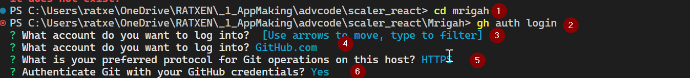
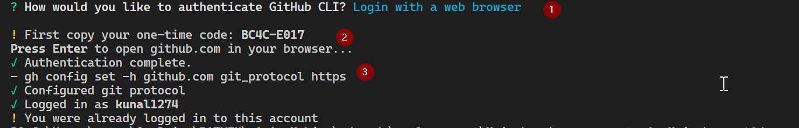
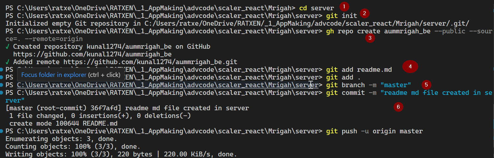
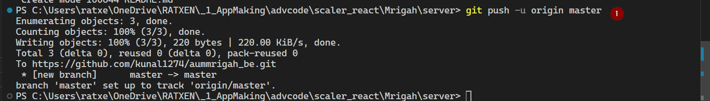
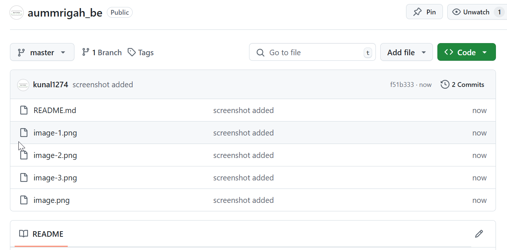
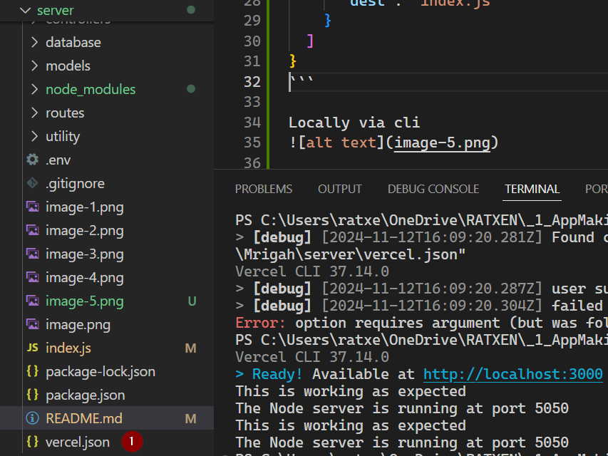
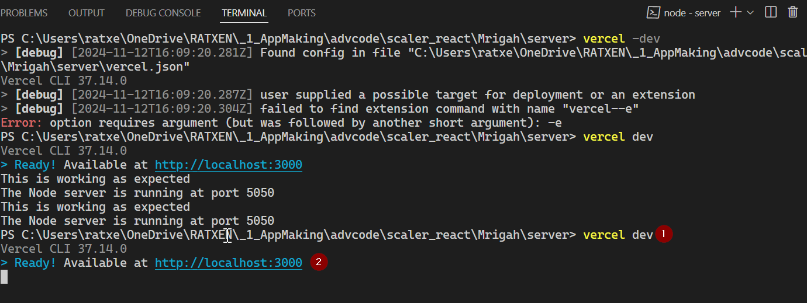
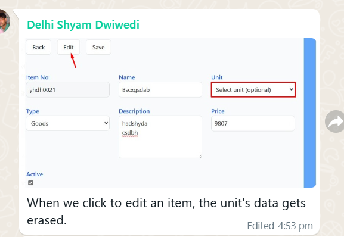

How to deploy the project to vercel :
first install the vercel cli :

```bash
npm i -g vercel
```

then configure the vercel.json in the root directory of the project

```json
{
  "version": 2,
  "builds": [
    {
      "src": "index.js",
      "use": "@vercel/node"
    }
  ],
  "routes": [
    {
      "src": "/(.*)",
      "dest": "index.js"
    }
  ]
}
```



Locally via cli


```bash
vercel dev
```

## item model


